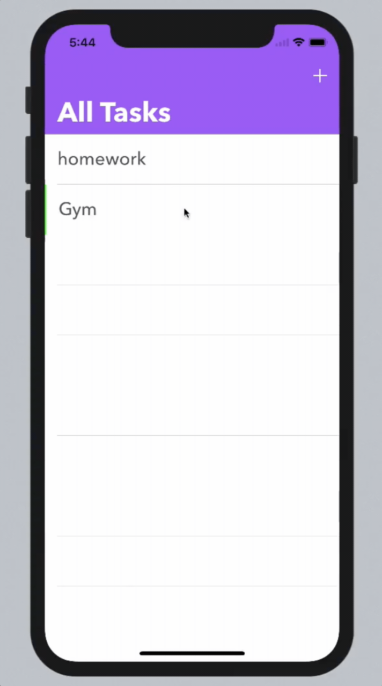

# ToDoApp

## Purpose
_TODO_ is repo for display what to do and we will add things we can do in future.

## Authors
- Tushar Jaunjalkar

### What you will learn:
- Swift 4.2
- Storyboards
- iOS Transitioning APIs
- Animiations
- Core data
- TableView
- Update, delete, insert data operation on core data
-

## Demo

